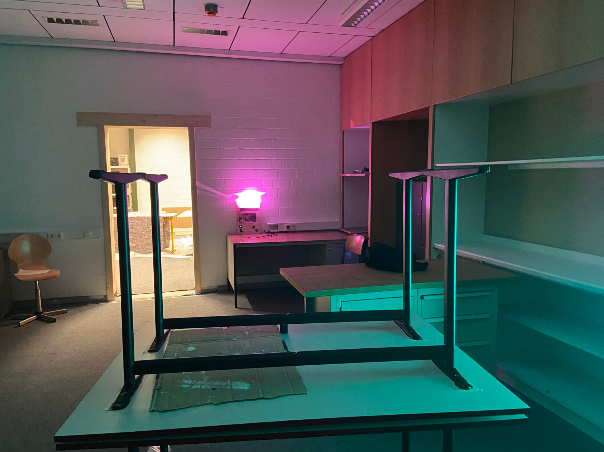

+++
title = "Licht"
date = 2024-05-09
description = "ESP32 und CREE High Power Leds ..."
weight = 100

[extra]
local_image = "/projects/licht/Licht.jpeg"

[taxonomies]
tags = ["ESP32", "LED", "CREE"]
+++

Das Licht ist eine Selbstbau-Lampe aus CREE High Power Star Leds, die über einen ESP32 Controller angesteuert werden.

