# Raspberry Pi Pico Projekte

## 1D Pong

Das 1D Pong ist eine Hardware-Implementierung von Pong in 1D.

Bei dem Spiel geht es um Reaktionszeit.
Ein virtueller Ball, dargestellt durch eine leuchtende LED, läuft von
einer Seite zur anderen. An jedem Ende hat der jeweilige Spieler ein paar
Felder, und entsprechend der Ballgeschwindigkeit ein paar Millisekunden,
um zu regieren und den Ball abzuwehren. Falls der Spieler nicht rechtzeitig
drückt, und der Ball aus dem Feld läuft, bekommt der andere Spieler einen
Punkt. Das Spiel endet wenn der erste Spieler 5 Punkte erreicht.

Zu Beginn wird auf der LED Leiste eine Warte-Animation abgespielt, bis ein
Spieler den Buzzer drückt. Der Spieler der zuerst Druck bekommt den ersten
"Aufschlag".

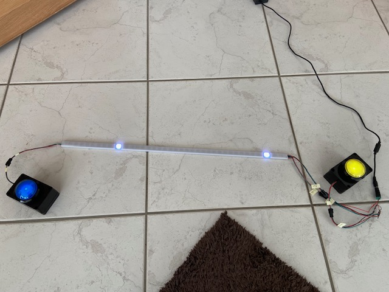

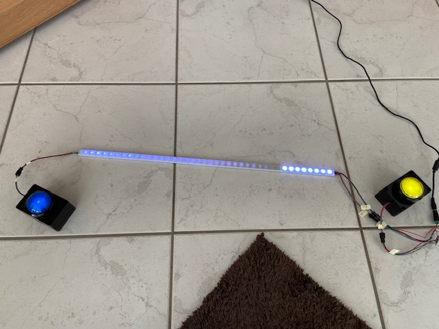

Hier ist der Ball in der Mitte des Spielfelds, durch die weiße leuchtende
LED dargestellt.

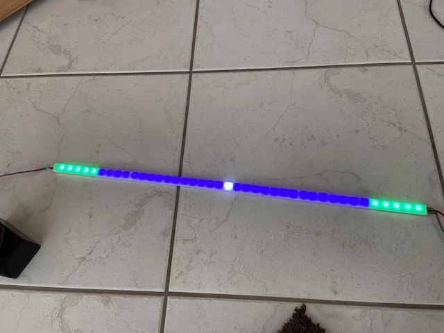

Der aktuelle Punktestand wird in der Mitte der LED Leiste angezeigt.

Hier har der "grüne" Spieler einen Punkt und hat den Ball:

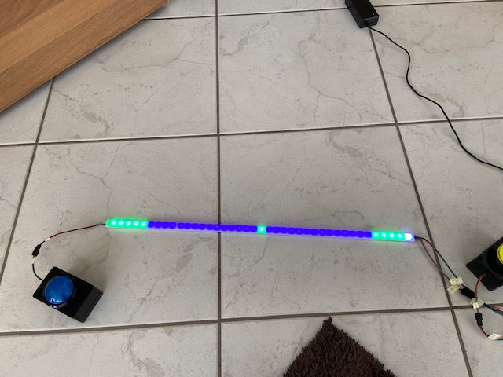

Hier hat der "grüne" Spieler zwei Punkte und der "rote" Spieler hat einen
Punkt. Der Ball liegt beim "roten" Spieler:

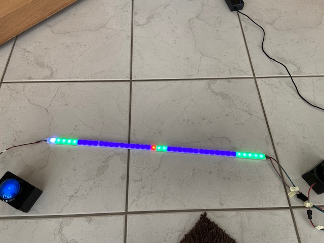

## Bauteile

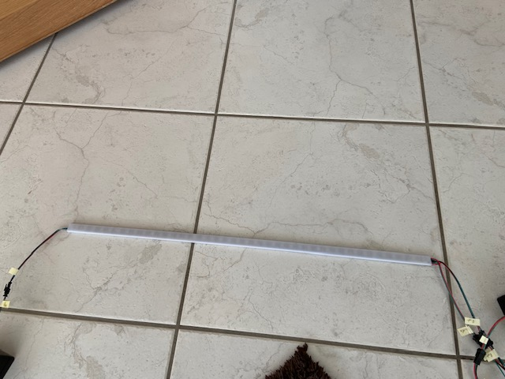

[WS2812B LED Strip](https://www.amazon.de/-/en/gp/product/B088BB8WTZ/ref=ppx_yo_dt_b_search_asin_title?ie=UTF8&th=1)

Die Dichte der LEDs und die gewünschte Anzahl and Spielfeldern bestimmt
die Größe der fertigen LED Leiste.

Ich habe noch einen [Alu-Profil mit Streuscheibe] verwendet. Das ist nicht
zwingend notwendig, kühlt aber die LEDs und macht die Optik schöner.

Um eine klare Trennung der "Pixel" zu bekommen habe ich zwischen die LEDs
Trenner aus Pappe mit Heißkleber eingeklebt.

Für einen einfacheren Aufbau habe ich die Kabel für den einen Buzzer auch mit
durch das Profil geführt. Die Masse kann man dabei von den LEDs bekommen, und
sich damit ein Kabel sparen.

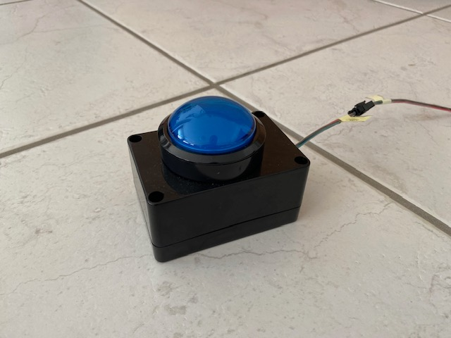

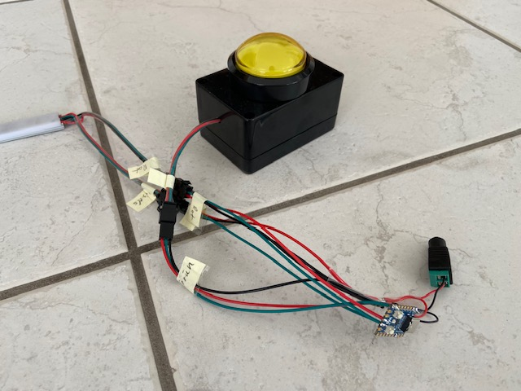

Buzzer aus [Arcade-Tastern](https://www.amazon.de/-/en/dp/B01MSNXLN0?psc=1&ref=ppx_yo2ov_dt_b_product_details) und [Abzweigdosen](https://www.amazon.de/-/en/dp/B09TXN1XGB?psc=1&ref=ppx_yo2ov_dt_b_product_details).

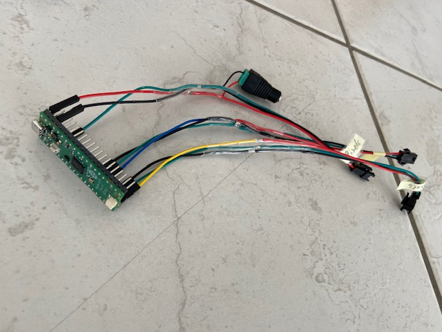

[Raspberry Pi Pico](https://www.berrybase.de/raspberry-pi-pico-rp2040-mikrocontroller-board)

Der Raspberry Pi Pico und der LED Strip können mit dem selben
[5V Netzteil](https://www.amazon.de/dp/B07P8HKFLL?psc=1&ref=ppx_yo2ov_dt_b_product_details)
versorgt werden.

## Schaltplan

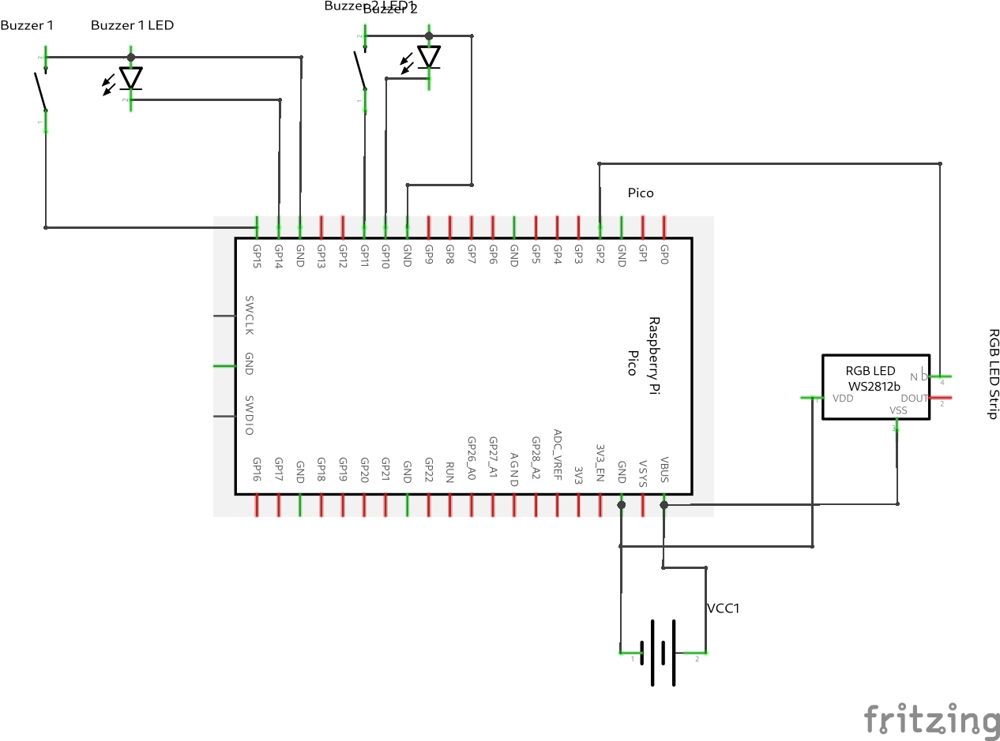

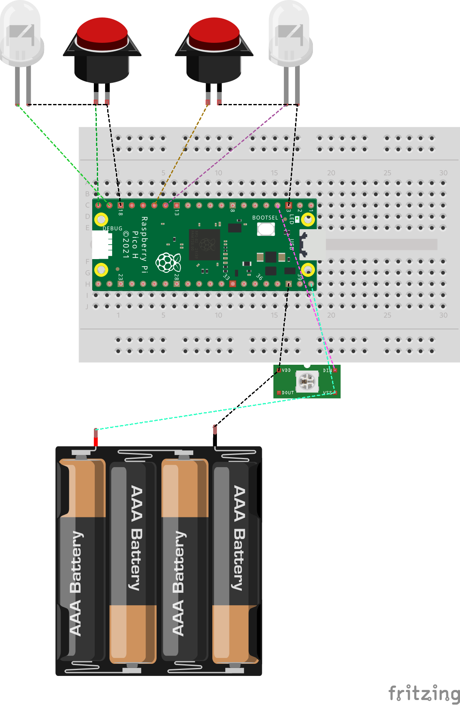

## Firmware

Am Anfang hatte ich eine Mircopython Firmware, was funktioniert aber die maximale
Ball-Geschwindigkeit doch begrenzt. Ich hatte vor die Firmware in Rust zu schreiben,
aber am Ende ist es aus Zeit- und Lernaufwands-Gründen doch C geworden.


```C
#include <stdio.h>
#include "pico/stdlib.h"
#include "hardware/gpio.h"
#include "ws2812/animations.h"
#include "ws2812/generated/ws2812.pio.h"

#define IS_RGBW false
#define NUM_PIXELS 40
#define WS2812_PIN 2
#define P2_LIGHT 10
#define P2_BUTTON 11
#define P1_LIGHT 14
#define P1_BUTTON 15
#define HIT_ZONE_SIZE 5
#define MAX_SCORE 5
#define DEFAULT_SPEED 20
#define SPEED_STEP 7
#define MAX_SPEED 5
#define HIT_SLEEP 500

// #define LARGE

volatile int button_pressed = 0;
volatile int p1_button_pressed = 0;
volatile int p2_button_pressed = 0;

volatile int player = 0;
volatile int p1_score = 0;
volatile int p2_score = 0;
volatile int speed = 20;
volatile int ball = 20;
volatile int direction = 0;
volatile int game_over = 0;


void clear() {
    for(int i=0; i<NUM_PIXELS; i++) {
        put_pixel(0);
    }
}

void win(int player) {
    clear();

    int offset = 0;
    switch(player) {
        case 1:
            break;
        case 2:
            offset = 1;
            break;
        default:
          printf("Invalid player id: %d\n", player);
          return;
    }

    printf("Player %d has won the game!\n", player);
    int  cnt = NUM_PIXELS / 2;
    for(int i=0; i<1000; i++) {
        if(player == 2) {
            for(int i=0; i<cnt; i++) {
                put_pixel(0);
            }
        }
        pattern_snakes(cnt, i);
        sleep_ms(10);
    }
}

void gpio_irq_callback(uint gpio, uint32_t event_mask) {
    switch(gpio) {
        case P1_BUTTON:
            if(button_pressed == 0) {
                button_pressed = 1;
            }
            p1_button_pressed = 1;
            break;
        case P2_BUTTON:
            if(button_pressed == 0) {
                button_pressed = 2;
            }
            p2_button_pressed = 1;
            break;
        default:
            printf("Unknown button: %d\n", gpio);
            return;
    }
}

void config_button_gpios() {
    gpio_init(P1_LIGHT);
    gpio_set_dir(P1_LIGHT, GPIO_OUT);
    gpio_init(P1_BUTTON);
    gpio_set_dir(P1_BUTTON, GPIO_IN);
    gpio_pull_up(P1_BUTTON);
    
    gpio_init(P2_LIGHT);
    gpio_set_dir(P2_LIGHT, GPIO_OUT);
    gpio_init(P2_BUTTON);
    gpio_set_dir(P2_BUTTON, GPIO_IN);
    gpio_pull_up(P2_BUTTON);


    gpio_set_irq_enabled_with_callback(P1_BUTTON, GPIO_IRQ_EDGE_FALL, true, &gpio_irq_callback);
    gpio_set_irq_enabled_with_callback(P2_BUTTON, GPIO_IRQ_EDGE_FALL, true, &gpio_irq_callback);
}

void clear_buttons() {
    button_pressed = 0;
    p1_button_pressed = 0;
    p2_button_pressed = 0;
}

void wait_animaiton() {
    gpio_put(P1_LIGHT, true);
    gpio_put(P2_LIGHT, true);
    
    clear_buttons();

    int t = 0;
    while(button_pressed == 0) {
        if(t < 512) {
            pattern_sparkle(NUM_PIXELS, t);
        }else if(t >= 512) {
            pattern_greys(NUM_PIXELS, t);
        }
        sleep_ms(10);
        t = (t + 1) % 1024;
    }
}

void update_buttons(int player) {
    switch(player) {
    case 0:
        gpio_put(P1_LIGHT, false);
        gpio_put(P2_LIGHT, false);
        break;
    case 1:
        gpio_put(P1_LIGHT, false);
        gpio_put(P2_LIGHT, true);
        break;
    case 2:
        gpio_put(P1_LIGHT, true);
        gpio_put(P2_LIGHT, false);
        break;
    default:
        printf("Unknown player: %d\n", player);
        break;
    }
}

void draw_field(bool bad_ball) {
#ifdef LARGE
    int32_t color_p1 = urgb_u32(255, 255, 0);
    int32_t color_p2 = urgb_u32(0, 0, 255);
    int32_t background = urgb_u32(50, 0, 0);
#else
    int32_t color_p1 = urgb_u32(0, 255, 0);
    int32_t color_p2 = urgb_u32(255, 0, 0);
    int32_t background = urgb_u32(0, 0, 50);
#endif

    int mid = (NUM_PIXELS / 2) - 1;
    int p1_score_min = mid - p1_score;
    int p2_score_max = mid + p2_score;
    for(int i=0; i<NUM_PIXELS; i++) {
        if(i == ball) {
            uint32_t color = urgb_u32(255, 255, 255);
            if(bad_ball) {
                color = urgb_u32(255, 0, 0);
            }
            put_pixel(color);
            continue;
        }


        if(i <= mid && i > p1_score_min) {
            put_pixel(color_p1);
            continue;
        }

        if(i > mid && i <= p2_score_max) {
            put_pixel(color_p2);
            continue;
        }

        if(i < HIT_ZONE_SIZE) {
            put_pixel(urgb_u32(0, 255, 0));
            continue;
        }

        if(i >= NUM_PIXELS - HIT_ZONE_SIZE) {
            put_pixel(urgb_u32(0, 255, 0));
            continue;
        }

        put_pixel(background);
    }
}

void wait_for_fire() {
    printf("Waiting for player to fire.\n");

    // debounce
    sleep_ms(100);
    // ignore previous press
    clear_buttons();

    ball = (player == 1) ? 0 : (NUM_PIXELS - 1);
    draw_field(false);

    update_buttons((player == 1) ? 2 : 1);
    clear_buttons();

    volatile int *button = (player == 1) ? &p1_button_pressed : &p2_button_pressed;
    while(*button == 0) {
        sleep_ms(DEFAULT_SPEED);
    }
    printf("Player fired.\n");
    update_buttons(player);
    clear_buttons();
}

void score(int p) {
    printf("Score player %d!\n", p);

    speed = DEFAULT_SPEED;

    switch(p) {
    case 1:
        player = 1;
        p1_score++;
        ball = 0;
        direction = 1;
        break;
    case 2:
        player = 2;
        p2_score++;
        ball = NUM_PIXELS - 1;
        direction = -1;
        break;
    default:
        printf("Unknown player: %d\n", player);
        return;
    }

    int winner = 0;
    if(p1_score >= MAX_SCORE) {
        winner = 1;
        game_over = 1;
    } else if(p2_score >= MAX_SCORE) {
        winner = 2;
        game_over = 1;
    }

    if(winner > 0) {
        update_buttons(0);
        win(winner);
    } else {
        // wait for scoring player to fire
        wait_for_fire();

        // continue game
        update_buttons(player);
        printf("Game: P1: %d, p2: %d\n", p1_score, p2_score);
    }
}

bool check_buttons() {
    bool pressed = false;
    int pos = -1;

    switch (player) {
    case 1:
        pos = (NUM_PIXELS - 1) - ball;
        if(p2_button_pressed) {
            pressed = true;
        }
        break;
    case 2:
        pos = ball;
        if(p1_button_pressed) {
            pressed = true;
        }
        break;
    default:
        printf("Unknown player: %d\n", player);
        clear_buttons();
        return false;
    }

    clear_buttons();

    if(pressed) {
        printf("Button press at pos %d (%d)\n", pos, ball);

        if(pos >= (NUM_PIXELS / 2)) {
            printf("Ignore early press.");
            clear_buttons();
            return false;
        }

        draw_field(true);
        sleep_ms(HIT_SLEEP);

        if(pos < HIT_ZONE_SIZE) {
            player = (player == 1) ? 2 : 1;
            update_buttons(player);

            printf("Player %d hit the ball!\n", player);

            direction = (direction == 1) ? -1 : 1;

            int speed_delta = (pos - 2);
            speed = DEFAULT_SPEED + (speed_delta * SPEED_STEP);
            if(speed < MAX_SPEED) {
                speed = MAX_SPEED;
            }
            printf("Ball speed: %d (%d)\n", speed, speed_delta);
        } else {
            printf("Player %d hit outside of the zone!\n", ((player == 1) ? 2 : 1));
            
            score(player);
            return true;
        }
    }

    clear_buttons();
    
    return false;
}

void reset_game() {
    player = 0;
    p1_score = 0;
    p2_score = 0;
    speed = DEFAULT_SPEED;
    ball = 20;
    direction = 0;
    game_over = 0;
}

void game() {
    reset_game();

    printf("=================\n");
    printf("    New game\n");
    printf("=================\n");
    
    player = button_pressed;
    update_buttons(player);
    printf("Player %d starts\n", player);

    switch(player) {
    case 1:
        ball = 0;
        direction = 1;
        break;
    case 2:
        ball = NUM_PIXELS - 1;
        direction = -1;
        break;
    default:
        printf("Unknown player: %d\n", player);
        return;
    }

    wait_for_fire();

    clear_buttons();
    while(!game_over) {
        draw_field(false);
        
        sleep_ms(speed);

        if(check_buttons(player)) {
            continue;
        }
        
        ball += direction;
        
        if(ball < 0) {
            score(2);
        } else if(ball >= NUM_PIXELS) {
            score(1);
        }
    }
}

int main()
{
    stdio_init_all();

    PIO pio = pio0;
    int sm = 0;
    uint offset = pio_add_program(pio, &ws2812_program);

    ws2812_program_init(pio, sm, offset, WS2812_PIN, 800000, IS_RGBW);

    config_button_gpios();

    while (1) {
        // enable button lights
        wait_animaiton();

        game();
    }

    return 0;
}
```
